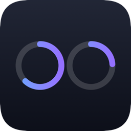

<p align="center">
  
</p>

<p align="center"><a href="README.md">English</a> | <b>日本語</b></p>

# Claude Meters

Claude Codeの **セッション（5時間）** と **週間** の使用率を、メニューバーの2つの円形メーターだけで確認できる、macOS用の小さなユーティリティです。

<p align="center">
  
</p>

> Two meters. That's it.

## 特徴

- メニューバーに2つの円形メーター（セッション5時間 / 週間）を使用率(%)で表示
- クリックするとPopoverで各メーターのリセットまでの時間を確認可能
- 自動更新（失敗時は指数バックオフ、スリープ復帰時は再取得）
- ログイン時起動、更新間隔の設定（1分 / 5分）
- システム言語に応じた日本語・英語対応
- VoiceOver対応
- ライトモード・ダークモード対応
- メニューバー常駐のみ（Dockアイコン・ウインドウなし）

## 動作環境

- macOS 13 (Ventura) 以降
- [Claude Code](https://claude.com/product/claude-code) がインストール・サインイン済みであること（Usage上限のあるPro/MaxプランまたはConsole課金）

## インストール

[Releases](../../releases) ページから最新のビルドをダウンロードし、解凍して `Claude Meters.app` を `/Applications` に移動してください。

> **Gatekeeperについて：** 署名・公証済みのリリースが用意できるまでは、初回起動時に「開発元が未確認のため開けません」という警告が表示されます。アプリを右クリック（またはControlキーを押しながらクリック）して「開く」を選ぶと、一度だけこの警告を回避できます。配布方針の詳細は[docs/REQUIREMENTS.md](docs/REQUIREMENTS.md)を参照してください。

## Usage情報の取得方法

Claude Meters自身は認証情報を要求・保存しません。代わりに、Claude Codeがすでに保存しているOAuthトークン（macOS Keychainの`Claude Code-credentials`）を読み取り、Claude Code自身が使っているのと同じUsage APIを呼び出します。初回アクセス時にはmacOS標準のKeychainアクセス許可ダイアログが一度表示され、（ログインパスワードで）許可するとこのトークンを読み取れるようになります。

このAPIはAnthropicの**公開・ドキュメント化されたAPIではありません**。予告なく変更される可能性があります。調査の詳細、この方式を採用した理由、既知のリスク（レート制限・形式変更・Keychainアクセスの挙動）については[docs/REQUIREMENTS.md](docs/REQUIREMENTS.md)を参照してください。

## 開発

Xcodeプロジェクトは[XcodeGen](https://github.com/yonaskolb/XcodeGen)によって`project.yml`から生成しています（`.xcodeproj`を手動編集した状態ではコミットしていません）。

```sh
brew install xcodegen
xcodegen generate
xcodebuild -project ClaudeMeters.xcodeproj -scheme ClaudeMeters build
```

テストの実行：

```sh
xcodebuild -project ClaudeMeters.xcodeproj -scheme ClaudeMeters -destination "platform=macOS" test
```

プロジェクト構成、要件、Keychain/Usage API方式に至る技術検証の詳細は[docs/REQUIREMENTS.md](docs/REQUIREMENTS.md)に記載しています。

## v1で実装しないもの

Usage履歴、グラフ、使用量予測、通知、複数アカウント、モデル別の内訳、Webダッシュボード、自動アップデート。詳細は[docs/REQUIREMENTS.md](docs/REQUIREMENTS.md)を参照してください。

## ライセンス

[MIT](LICENSE)
